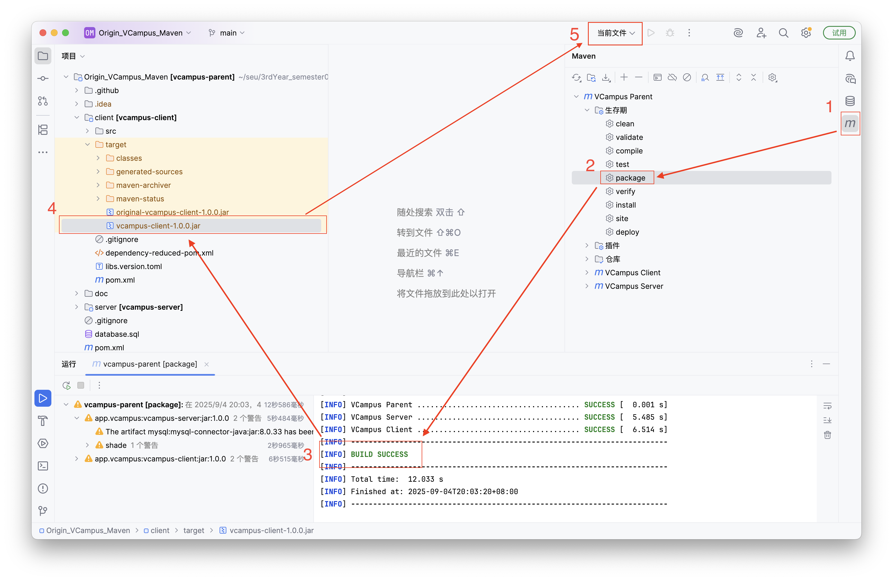
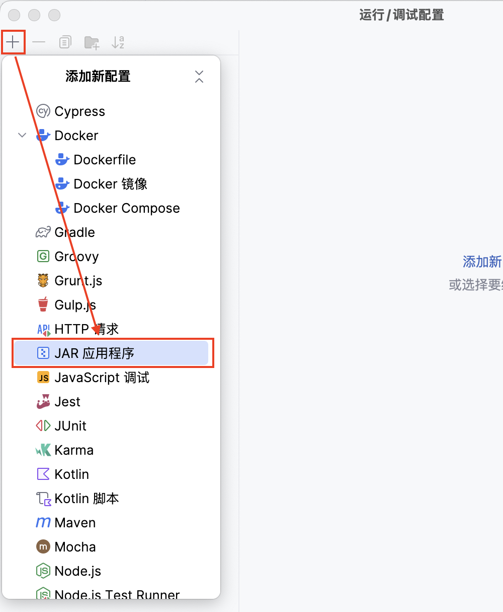
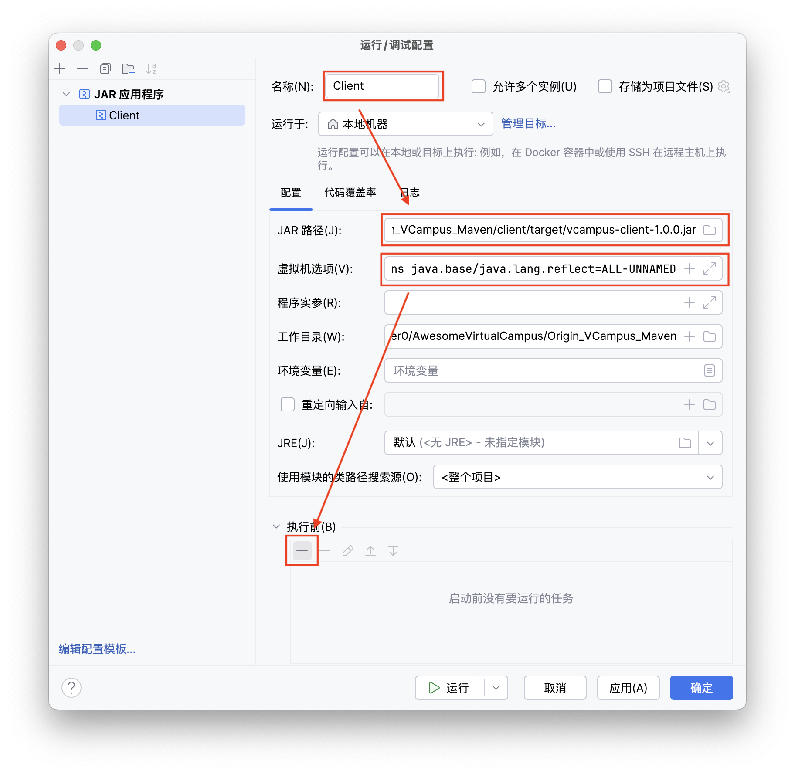
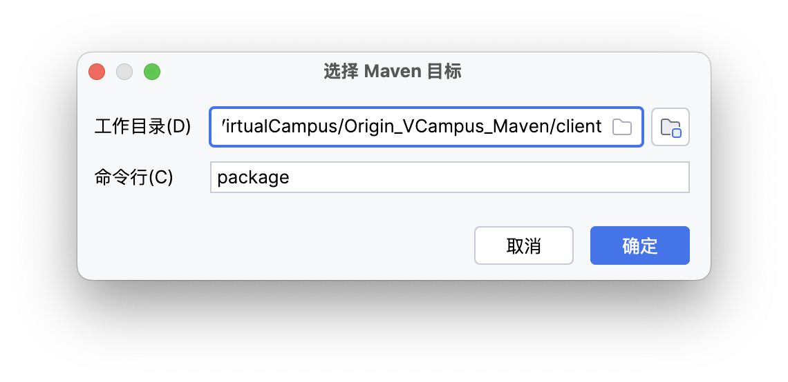

# 开发者指南

## 配置 IDEA

1. 首先执行 `clone`将代码拉至本地

```bash
git clone https://github.com/zeroffa233/AwesomeVirtualCampus.git
```

2. 用 `IntelliJ IDEA` 打开 `AwesomeVirtualCampus/Origin_VCampus_Maven`
3. 若`IDEA`提示 “检测到Hibernate框架” ，点击 “配置” ，而后在弹出的窗口点击“确定”

### 配置 Client 以一键打包并运行


1. 如上图，先轻点右侧的  `Maven` 插件，在弹出的窗口中展开 `生存期` 菜单，选择`package`
2. 待 `BUILD SUCCESS` 字样出现后，在左侧项目菜单中找到`vcampus-client-1.0.0.jar`，而后点击右上角的 `当前文件` 

<p align="center">
  
</p>

3. 在弹出的窗口中点击左上角的加号，添加一个新配置，选择 `JAR应用程序` 



4. 在窗口右侧，依次设置`名称`，`JAR路径`，`虚拟机选项`。其中`虚拟机选项`为如下内容。配置好虚拟机选项后，点击 “执行前” 部分的加号，选择“运行Maven目标”


```bash
--add-opens java.base/java.lang.reflect=ALL-UNNAMED
```


5. 在弹出的窗口选择`Maven`目标，注意工作目录并不是默认而是`/client`，命令行写 `package` 。
6. 一路确定，配置好后，选中`IDEA`右上角的`Client`（即刚刚生成的配置名称，因人而异），然后运行。此时即可一键打包并运行`Client`

### 配置 Server 以一键打包

可参考 Client 的配置方法，配置一个 `Maven` 选项，“运行”一栏填 `package`，工作目录为`vcampus-server`，

Serevr 是一个**命令行**程序，**请在终端中运行**。若在 `IDEA` 中尝试运行 Server ，会提示 “控制台不可用。请在终端中运行此程序！”。

```bash
java -jar path/vcampus-server-1.0.0.jar #请将这里的path替换为正确的路径
```

在尝试运行 Server 之前，请确保启动了 MySQL Server 并配置好数据库。以下是相关命令

```bash
mysql -u root -p
mysql> CREATE DATABASE vcampus; # 注意，这里数据库的名称必须是 vcampus 
mysql> USE vcampus;
mysql> exit
mysql -u root -p vcampus < path/to/your/file.sql
mysql -u root -p
mysql> USE vcampus;
mysql> SHOW TABLES;
```
